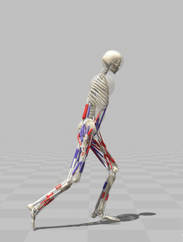
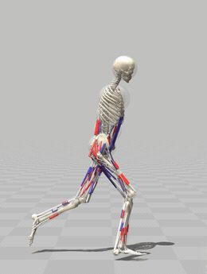
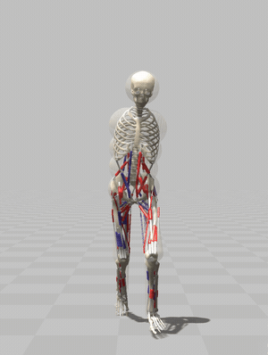
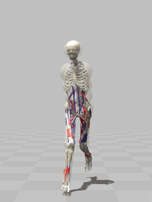
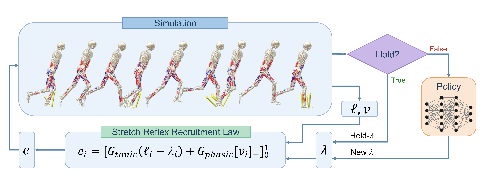

# Lambda-Hold Control

<p align="center">
  <a href="https://lee-jun-hyuk-37.github.io/projects/lambda-hold/"></a>
  &nbsp;&nbsp;
  <a href="https://arxiv.org/abs/2608.17030"></a>
</p>

<table>
<tr>
<td width="25%"></td>
<td width="25%"></td>
<td width="25%"></td>
<td width="25%"></td>
</tr>
<tr align="center" valign="middle">
<td>Sagittal</td>
<td>Sagittal, slow (×1/4)</td>
<td>Frontal</td>
<td>Frontal, slow (×1/4)</td>
</tr>
</table>

## Abstract

The massive overactuation in the human musculoskeletal system makes it
challenging to train musculoskeletal models to generate human-like motion via
reinforcement learning, primarily because exploration in the resulting
high-dimensional and redundant action space is extremely inefficient. To address
this problem, we propose the λ-hold controller, inspired by the
equilibrium-point (EP) hypothesis, which has been widely supported by extensive
evidence from human motor control studies. The policy's control variable is the
per-muscle EP threshold length λ, from which a stretch-reflex recruitment law
computes the muscle excitations automatically. Holding each λ over an interval of
the gait phase also sharply reduces the frequency at which the policy must be
queried. Consequently, the controller, to our knowledge for the first time,
enables a muscle-actuated skeletal model to learn human-like sprinting using only
a minimal reward within an hour of training. The efficient exploration through
the proposed λ-hold controller is not merely an engineering trick but an approach
grounded in physiology, bringing together the EP hypothesis, intermittent
control, and optimal feedback control. Beyond encapsulating human-like behavior
in predictive simulation, this achievement contributes to developing a learnable
model of the human motor controller.



## Installation

The simulator is [SCONE](https://scone.software) with the [Hyfydy](https://hyfydy.com/)
engine, which provides the `sconepy` Python module and the H2190 musculoskeletal model. Install
SCONE first and make sure `from sconetools import sconepy` works in your Python
environment.

Then clone this repository with its submodule and set up the environment:

```bash
git clone --recursive https://github.com/Lee-Jun-Hyuk-37/Lambda-Hold.git
cd Lambda-Hold
conda env create -f environment.yml
conda activate lambda-hold
pip install -e external/sconegym
```

(If you cloned without `--recursive`, run `git submodule update --init` first.)

## Training

```bash
python train.py --out runs/lambda_hold --seed 1
```

Training runs until the simulation-step budget is reached (150 million steps by
default) and writes periodic checkpoints, the final model, the observation
normalization statistics, and a learning curve (`result.json`) to the output
directory. The five curves in the paper come from seeds 1 through 5. Pass
`--help` to see the controller, reward, and optimizer options; the defaults
reproduce the reported runs.

## Viewing the result

```bash
python rollout.py \
    --model runs/lambda_hold/model_final.zip \
    --vecnormalize runs/lambda_hold/vecnormalize.pkl
```

This runs the trained policy deterministically and writes each episode to
SCONE's results directory in its native format. Open the resulting `.sto` file
in SCONE Studio to watch the emergent sprint.

## Citation

```bibtex
@article{lee2026lambdahold,
  title   = {Lambda-Hold Control: Human-Like Movement Emerges from a Minimal
             Task Reward in Predictive Musculoskeletal Simulation},
  author  = {Lee, Jun Hyuk and Lee, Chihyeong and Ahn, Jooeun},
  journal = {arXiv preprint arXiv:2608.17030},
  year    = {2026}
}
```

## License

This project is released under the MIT License (see `LICENSE`). The bundled
`external/sconegym` submodule is distributed under its own Apache-2.0 license.
